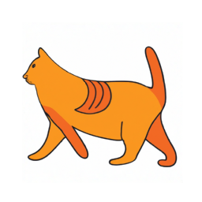

# SVG creator

Playing with OpenAI's image generation API to generate images and then convert them to SVG vector art

## How to use

Create a file called `.env` and include your OpenAI API key there (see `.env.example`)

```bash
python3 -m venv venv
source venv/bin/activate
pip install -r requirements.txt
python main.py
```

## Examples

Prompt: "Cat and Rabbit dancing"

AI image (`png`):


Vector art (`svg`):


## Experimentation in jupyter

```bash
jupyter notebook
```
